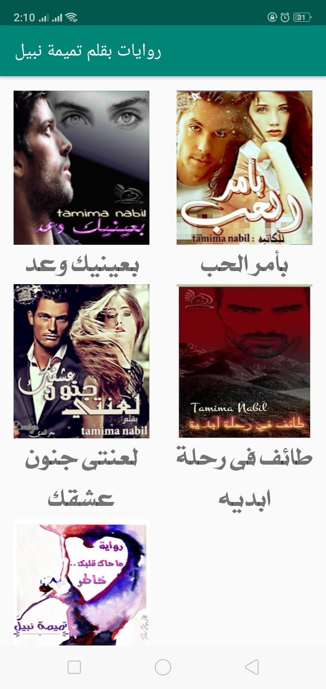
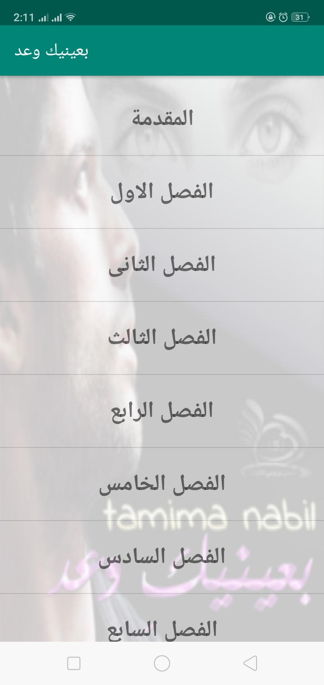

# tamima_books
<h3>android app which collects all the  novels for an  Arabic writer called tamima nabil</h3>

<h4>this app contain 3 activities </h4>
<ol>
  <li>splash screen activity</li>
  <li>the mean activity</li>
  <li>chapters or (book content) activity which contain 2 fragments 
    <ul>
      <li>the first fragment is : book chapters list</li>
      <li> the second one is : the chapter content</li>
    </ul>
  </li>
</ol>
<h5>the splash screen</h5>

this activity is temporary screen as it loads the mean activity once it recieve book data.

<h5>the mean activity or (books List)</h5>

this activity is bind the data it recieved from splash activity to grid of cover book and the book title once tapping on book the book chapters list will loaded.

<h5>the chapters activity</h5>

display list chapters the tapped book contain with the cover image as background once user click on item of this list it'll load content fragment with chapter data , which is the title of this chapter and it's content

